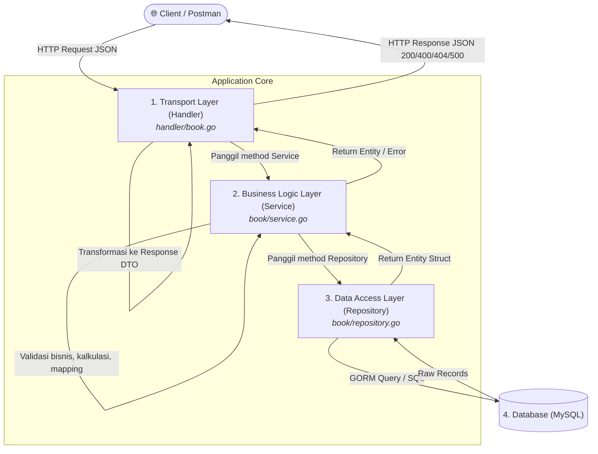

# Pustaka API

RESTful API untuk manajemen data buku sederhana yang dibangun dengan **Golang**, **Gin Web Framework**, dan **GORM ORM** menggunakan pola arsitektur berlapis (*Layered Architecture*) serta berbagai *Design Pattern* standar industri.

---

## 🛠️ Tech Stack

- **Bahasa Pemrograman**: [Golang](https://go.dev/) (v1.26+)
- **Web Framework**: [Gin Gonic](https://github.com/gin-gonic/gin)
- **ORM**: [GORM](https://gorm.io/) (MySQL Driver)
- **Database**: MySQL
- **Validation**: [go-playground/validator](https://github.com/go-playground/validator)

---

## 🏛️ Arsitektur Proyek & Design Pattern

Proyek ini menerapkan **Layered Architecture** (*Separation of Concerns*) yang memisahkan aplikasi menjadi lapisan-lapisan independen, dipadukan dengan implementasi *Design Pattern* untuk mempermudah pemeliharaan (*maintainability*), pengujian (*testability*), dan skalabilitas.

### 1. Struktur Direktori Proyek

```
pustaka-api/
├── book/
│   ├── entity.go        # Domain Model / Database Schema Entity
│   ├── repository.go    # Data Access Layer (GORM queries & Repository Interface)
│   ├── service.go       # Business Logic Layer (Business Rules & Service Interface)
│   ├── request.go       # Input DTO (Validation tags & payload contract)
│   └── response.go      # Output DTO (Contract data yang dikembalikan ke client)
├── handler/
│   └── book.go          # Transport Layer (HTTP Controller & Gin Context)
├── docs/
│   └── learn/           # Catatan belajar teknis & riwayat arsitektur
├── main.go              # Entry point: DB Configuration, Dependency Injection, & Routing
├── go.mod
└── go.sum
```

---

### 2. Diagram Aliran Data Antar Layer



---

### 3. Design Pattern yang Diterapkan

#### A. Repository Pattern
* **File:** `book/repository.go`
* **Penerapan:** Mengabstraksi operasi database di balik interface `book.Repository`.
* **Keuntungan:** Lapisan logika bisnis (*Service*) tidak perlu tahu apakah data disimpan di MySQL, PostgreSQL, atau in-memory. Jika suatu saat ingin mengganti ORM atau database, layer *Service* tidak perlu diubah sama sekali.

#### B. Service Layer Pattern
* **File:** `book/service.go`
* **Penerapan:** Menampung seluruh aturan bisnis (*business rules*) di balik interface `book.Service`.
* **Keuntungan:** Menjaga *Handler* tetap ramping (*thin controller*). Handler hanya bertugas menerima HTTP request dan mengembalikan response, sedangkan logika konversi tipe data, kalkulasi diskon, dan pengecekan keberadaan data dilakukan di *Service*.

#### C. Data Transfer Object (DTO) Pattern
* **File:** `book/request.go` (Input DTO) & `book/response.go` (Output DTO)
* **Penerapan:**
  - `BookRequest`: Menjamin hanya data yang sesuai kontrak validasi yang boleh masuk ke sistem.
  - `BookResponse`: Menyaring field internal entity database (seperti `CreatedAt`, `UpdatedAt`) agar tidak terekspos langsung ke client secara sembarangan.

#### D. Dependency Injection (DI) & Inversion of Control (IoC)
* **File:** `main.go`
* **Penerapan:** Dependensi disuntikkan (*injected*) dari luar melalui constructor, bukan dibuat langsung (*hardcoded*) di dalam struct:
  ```go
  // main.go melakukan wiring dependensi:
  bookRepository := book.NewRepository(db)           // DB di-inject ke Repo
  bookService    := book.NewService(bookRepository)  // Repo di-inject ke Service
  bookHandler    := handler.NewBookHandler(bookService) // Service di-inject ke Handler
  ```
* **Keuntungan:** *Loose Coupling* (ikatan antar modul longgar) dan mematuhi prinsip **D** pada SOLID (*Dependency Inversion Principle*).

#### E. Constructor / Factory Pattern
* **Penerapan:** Menggunakan fungsi `New...` (`NewRepository`, `NewService`, `NewBookHandler`) untuk membuat instance struct.
* **Keuntungan:** Menjamin sebuah struct selalu diinisialisasi dengan dependensi yang lengkap dan valid.

#### F. Interface-based Decoupling (Go Implicit Interface / Duck Typing)
* **Penerapan:** Struct `service` dan `bookHandler` bergantung pada tipe data `interface`, bukan struct konkret:
  ```go
  type Service interface {
      FindAll() ([]Book, error)
      FindByID(ID int) (Book, error)
      Create(bookRequest BookRequest) (Book, error)
      Update(bookRequest BookRequest, ID int) (Book, error)
      Delete(ID int) (Book, error)
  }
  ```
* **Keuntungan:** Sangat mudah membuat *Mock Service* atau *Mock Repository* saat menulis **Unit Test** tanpa perlu terhubung ke database asli.

---

### 4. Tabel Tanggung Jawab & Batasan per Layer

| Layer | Boleh Dilakukan ✅ | Dilarang Dilakukan ❌ |
| :--- | :--- | :--- |
| **Handler** | Parsing URL param, binding JSON, validasi HTTP, menentukan status code (200, 400, 404, 500). | Memanggil query SQL / GORM langsung; memproses perhitungan logika bisnis. |
| **Service** | Validasi aturan bisnis, kalkulasi nilai, konversi tipe data (DTO ↔ Entity), memanggil beberapa repo sekaligus. | Membaca object Gin `c *gin.Context`; mengakses database SQL langsung tanpa repository. |
| **Repository** | Menjalankan query GORM (`First`, `Find`, `Create`, `Save`, `Delete`), mengembalikan entity/error. | Mengurus HTTP status code atau format JSON; melakukan kalkulasi bisnis. |
| **Entity** | Mendefinisikan kolom tabel dan relasi model database. | Menyimpan logic query atau HTTP binding tags. |

---

## 🚀 Panduan Memulai

### 1. Prasyarat
- Pastikan [Go](https://go.dev/dl/) sudah terinstal di komputer.
- Pastikan service **MySQL** sudah berjalan (misal via XAMPP, Laragon, atau Docker).

### 2. Setup Database
Buat database baru di MySQL dengan nama `pustaka-api`:
```sql
CREATE DATABASE `pustaka-api`;
```
> Tabel `books` akan otomatis dibuat oleh fitur **AutoMigrate** GORM saat aplikasi pertama kali dijalankan.

### 3. Konfigurasi Koneksi
Koneksi database diatur pada file `main.go`:
```go
dsn := "root:@tcp(127.0.0.1:3306)/pustaka-api?charset=utf8mb4&parseTime=True&loc=Local"
```
*Sesuaikan username, password, host, atau port jika konfigurasi MySQL lokal kamu berbeda.*

### 4. Menjalankan Aplikasi
Unduh dependensi dan jalankan server:
```bash
# Download modul dependensi
go mod tidy

# Jalankan server
go run main.go
```
Server akan berjalan di: `http://localhost:8080`

---

## 📡 Daftar Endpoint API (RESTful)

Base URL: `http://localhost:8080/v1`

| HTTP Method | Endpoint | Deskripsi | Status Code |
| :--- | :--- | :--- | :--- |
| `GET` | `/v1/books` | Mengambil semua daftar buku | `200 OK` |
| `GET` | `/v1/books/:id` | Mengambil detail buku berdasarkan ID | `200 OK` / `404 Not Found` |
| `POST` | `/v1/books` | Menambahkan buku baru | `200 OK` / `400 Bad Request` |
| `PUT` | `/v1/books/:id` | Memperbarui data buku berdasarkan ID | `200 OK` / `404 Not Found` |
| `DELETE` | `/v1/books/:id` | Menghapus buku berdasarkan ID | `200 OK` / `404 Not Found` |

---

## 📝 Contoh Request & Response

### 1. Tambah Buku Baru (`POST /v1/books`)

**Request Body (JSON):**
```json
{
  "title": "Atomic Habits",
  "price": "120000",
  "description": "Perubahan kecil yang memberikan hasil luar biasa.",
  "rating": "5",
  "discount": "10"
}
```

**Response (`200 OK`):**
```json
{
  "message": "Book created successfully",
  "data": {
    "id": 1,
    "title": "Atomic Habits",
    "price": 120000,
    "description": "Perubahan kecil yang memberikan hasil luar biasa.",
    "rating": 5,
    "discount": 10
  }
}
```

---

### 2. Update Buku (`PUT /v1/books/:id`)

**Request Body (JSON):**
```json
{
  "title": "Atomic Habits (Hardcover Edition)",
  "price": "150000",
  "description": "Edisi hardcover terbaru.",
  "rating": "5",
  "discount": "15"
}
```

**Response (`200 OK`):**
```json
{
  "message": "Book updated successfully",
  "data": {
    "id": 1,
    "title": "Atomic Habits (Hardcover Edition)",
    "price": 150000,
    "description": "Edisi hardcover terbaru.",
    "rating": 5,
    "discount": 15
  }
}
```

---

### 3. Hapus Buku (`DELETE /v1/books/:id`)

**Response Sukses (`200 OK`):**
```json
{
  "message": "Book deleted successfully",
  "data": {
    "id": 1,
    "title": "Atomic Habits (Hardcover Edition)",
    "price": 150000,
    "description": "Edisi hardcover terbaru.",
    "rating": 5,
    "discount": 15
  }
}
```

**Response Jika ID Tidak Ditemukan (`404 Not Found`):**
```json
{
  "error": "record not found"
}
```

---

## 📚 Catatan Belajar & Dokumentasi

Untuk penjelasan teknis mendalam mengenai arsitektur, analogi konsep dengan framework lain (Laravel & Next.js), serta studi kasus bug, silakan baca:
- [Catatan 01: Refactoring Layered Architecture & Fix Field Description](docs/learn/penjelasan_01_refactor_service_handler.md)
- [Catatan 02: RESTful CRUD Lengkap & Penanganan Error GORM (`db.Find` vs `db.First`)](docs/learn/penjelasan_02_crud_lengkap_dan_gorm_handling.md)
