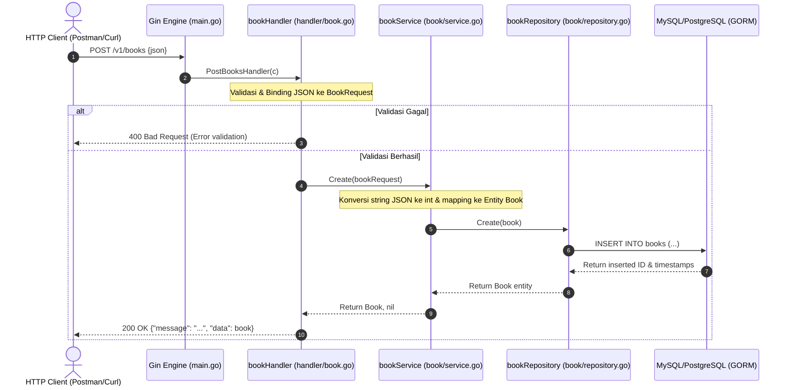

# Catatan Belajar: Refactoring Layered Architecture & Fix Field Description

Dokumentasi ini merangkum perubahan kode dari script procedural menjadi arsitektur berlapis (*Layered Architecture*), serta perbaikan bug mapping data pada project `pustaka-api`.

---

## 1. Masalah Awal: Field `Description` Tidak Tersimpan

### Gejala
Field `description` dikirim melalui JSON dan lolos validasi request, namun saat dicek di database nilainya kosong (`""`).

### Penyebab
Data di request tidak otomatis langsung masuk ke database. Di Go, mapping dari DTO request (`BookRequest`) ke entity database (`Book`) dilakukan secara eksplisit. Sebelumnya, field `Description`, `Rating`, dan `Discount` belum dipetakan di method `Create()` pada layer Service.

---

## 2. Tabel Analogi Konsep (Golang vs Laravel vs Next.js)

| Konsep di Golang (Kode Ini) | Padanan di Laravel | Padanan di Next.js / TypeScript | Fungsi / Tanggung Jawab |
| :--- | :--- | :--- | :--- |
| **`BookRequest`** (`book/request.go`) | `FormRequest` (`rules()`) | Zod Schema / DTO Body Type | Validasi & kontrak format data input HTTP |
| **`bookHandler`** (`handler/book.go`) | `BookController` | Route Handler (`route.ts`) | Menerima HTTP request, parsing JSON, kirim response |
| **`bookService`** (`book/service.go`) | Service / Action Class | Server Action / Lib Service | Business logic, konversi tipe data, mapping entity |
| **`bookRepository`** (`book/repository.go`) | Eloquent Model Query / Repo | Data Access Layer (Prisma Client) | Eksekusi query database via GORM (`db.Create`) |
| **Wiring di `main.go`** (`main.go`) | Service Provider / DI Container | Bootstrap server / Root Layout | Menghubungkan dependensi DB → Repo → Service → Handler |

---

## 3. Alur Data (Request Lifecycle)



---

## 4. Bedah Perubahan Kode

### 1. `book/request.go`
Menambahkan definisi field `Description`, `Rating`, dan `Discount` lengkap dengan tag JSON dan validator Gin:
```go
type BookRequest struct {
	Title       string      `json:"title" binding:"required"`
	Price       json.Number `json:"price" binding:"required,number"`
	Description string      `json:"description" binding:"required"`
	Rating      json.Number `json:"rating" binding:"required,number"`
	Discount    json.Number `json:"discount" binding:"required,number"`
}
```

### 2. `book/service.go`
- Menerapkan pola **Fail-Fast** untuk konversi tipe data angka (`json.Number` $\rightarrow$ `int64`).
- Memetakan field `Description`, `Rating`, dan `Discount` ke struct `Book`:
```go
func (s *service) Create(bookRequest BookRequest) (Book, error) {
	price, err := bookRequest.Price.Int64()
	if err != nil {
		return Book{}, err
	}

	rating, err := bookRequest.Rating.Int64()
	if err != nil {
		return Book{}, err
	}

	discount, err := bookRequest.Discount.Int64()
	if err != nil {
		return Book{}, err
	}

	book := Book{
		Title:       bookRequest.Title,
		Price:       int(price),
		Description: bookRequest.Description,
		Rating:      int(rating),
		Discount:    int(discount),
	}

	newBook, err := s.repository.Create(book)
	return newBook, err
}
```

### 3. `handler/book.go`
Mengubah fungsi independen menjadi struct handler dengan Dependency Injection (`bookService`):
```go
type bookHandler struct {
	bookService book.Service
}

func NewBookHandler(bookService book.Service) *bookHandler {
	return &bookHandler{bookService}
}

func (h *bookHandler) PostBooksHandler(c *gin.Context) {
	var bookRequest book.BookRequest

	err := c.ShouldBindJSON(&bookRequest)
	if err != nil {
		// Validasi input
		...
		return
	}

	book, err := h.bookService.Create(bookRequest)
	if err != nil {
		c.JSON(http.StatusInternalServerError, gin.H{"error": err.Error()})
		return
	}

	c.JSON(http.StatusOK, gin.H{
		"message": "Book created successfully",
		"data":    book,
	})
}
```

### 4. `main.go`
Wiring seluruh lapisan aplikasi dan menghubungkan method handler ke router Gin:
```go
bookRepository := book.NewRepository(db)
bookService := book.NewService(bookRepository)
bookHandler := handler.NewBookHandler(bookService)

router := gin.Default()
v1 := router.Group("/v1")

v1.POST("/books", bookHandler.PostBooksHandler)
```

---

## 5. Konsep Kunci Bahasa Go yang Dipelajari

1. **Method Receiver `(h *bookHandler)`**: Cara Go mengaitkan fungsi ke sebuah struct, fungsinya mirip dengan `$this` (PHP) atau `this` (TypeScript) pada class.
2. **Constructor Pattern (`New...`)**: Konvensi di Go untuk membuat dan menginisialisasi instance struct, biasanya mengembalikan pointer (`*struct`).
3. **Encapsulation via Capitalization**:
   - Huruf depan **Kapital** (`NewBookHandler`, `Title`) = Public (*Exported*).
   - Huruf depan **Kecil** (`bookHandler`, `service`) = Private (*Unexported*).
4. **Fail-Fast Error Handling**: Mengecek error langsung setelah pemanggilan fungsi (`if err != nil`) untuk menghindari error tertimpa (*overwritten/shadowed*).
