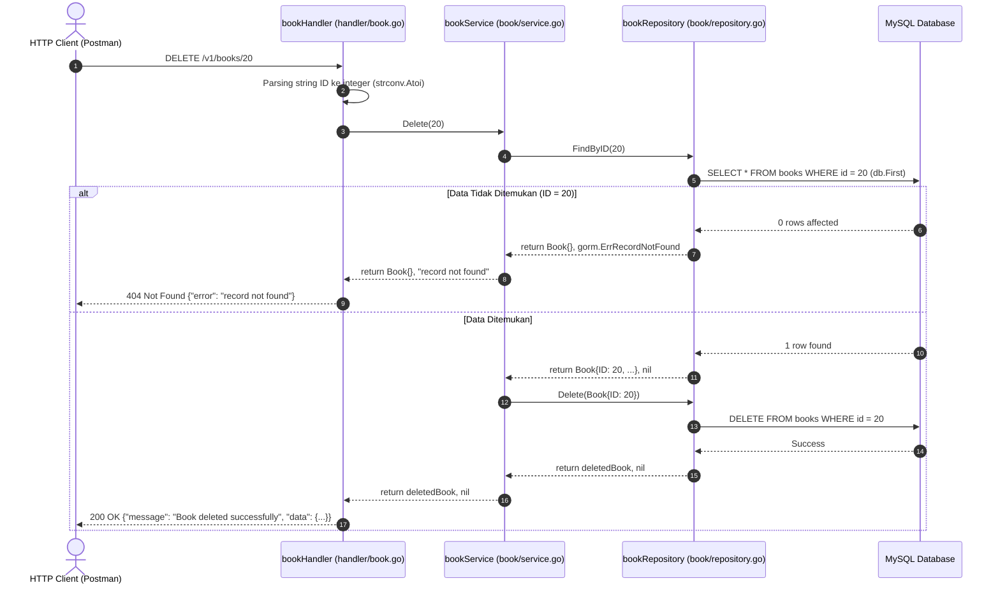

# Catatan Belajar: Implementasi RESTful CRUD Lengkap & Penanganan Error GORM (`db.Find` vs `db.First`)

Dokumentasi ini merangkum proses penyelesaian endpoint RESTful CRUD pada package `book`, pemisahan layer DTO response, serta bedah akar masalah error `Where condition required` saat menghapus data yang tidak ada di database.

---

## 1. Masalah: Error `Where condition required` Saat Delete Data yang Tidak Ada

### Gejala
Ketika mengirim request `DELETE /v1/books/20` (di mana record dengan ID 20 tidak ada di database), API justru mengembalikan pesan error:
```json
{
  "error": "WHERE conditions required"
}
```
Seharusnya, jika data tidak ditemukan, API memberikan respons yang relevan, yaitu `404 Not Found` dengan pesan `"record not found"`.

### Akar Penyebab
Perhatikan method `FindByID` dan `Delete` di repository dan service:
1. Di repository sebelumnya:
   ```go
   func (r *repository) FindByID(ID int) (Book, error) {
       var book Book
       err := r.db.Find(&book, ID).Error // <-- Masalahnya di sini
       return book, err
   }
   ```
2. **Karakteristik `db.Find` pada GORM**:
   - `Find` dirancang untuk mencari banyak data (*collection/slice*).
   - Saat data dengan ID yang dicari **tidak ada**, GORM **TIDAK menganggap ini sebagai error** (`err == nil`).
   - Variabel `book` tetap bernilai *zero value* bawaan struct Go: `Book{ID: 0, Title: "", Price: 0, ...}`.
3. **Efek Domino di Service**:
   Karena `err == nil`, pengecekan `if err != nil` di `service.Delete()` terlewati dan langsung mengeksekusi `repository.Delete(book)` dengan `book.ID == 0`.
4. **Proteksi Keamanan GORM (BlockGlobalDelete)**:
   Saat memanggil `db.Delete(&book)` dengan primary key bernilai `0` (kosong) dan tanpa klausul `.Where(...)`, GORM menolak mengeksekusi query. Ini adalah mekanisme proteksi agar sistem tidak mengeksekusi perintah berbahaya seperti `DELETE FROM books;` (menghapus seluruh tabel). GORM melempar error: **`WHERE conditions required`**.

### Solusi
Mengubah pemanggilan di `FindByID` dari `r.db.Find(&book, ID)` menjadi **`r.db.First(&book, ID)`**.
Method `First` mencari record tunggal. Jika data tidak ada di database, GORM otomatis mengembalikan error **`gorm.ErrRecordNotFound`** (`"record not found"`).

---

## 2. Tabel Analogi Konsep (Golang vs Laravel vs Next.js)

| Konsep di Fitur Ini | Padanan di Laravel | Padanan di Next.js / TypeScript | Fungsi / Tanggung Jawab |
| :--- | :--- | :--- | :--- |
| **`Book` Entity** | Eloquent Model | Prisma Model / Drizzle Table | Representasi struktur tabel di database |
| **`BookRequest`** | FormRequest (`rules()`) | Zod Request Schema / DTO Body | Validasi & kontrak input data dari client |
| **`BookResponse`** | API Resource (`JsonResource`) | TypeScript Response DTO Interface | Memformat dan membatasi data yang dikembalikan ke client |
| **`db.First(&book, id)`** | `Book::findOrFail($id)` | `prisma.book.findUniqueOrThrow()` | Ambil satu record, lempar error jika tidak ditemukan |
| **`db.Find(&book, id)`** | `Book::find($id)` | `prisma.book.findFirst()` | Ambil record, tidak melempar error jika kosong |
| **`bookRepository`** | Repository / Query Scope | Data Access Layer (Prisma Client) | Mengelola query database langsung via GORM |
| **`bookService`** | Service Class / Action | Server Action / Lib Service | Mengatur alur logika bisnis dan validasi data |
| **`bookHandler`** | Controller (`BookController`) | Route Handler (`app/api/books/route.ts`) | Menerima HTTP request, parsing ID, kirim status code HTTP |
| **Wiring di `main.go`** | Service Container / Providers | Server Bootstrap / Module Wiring | Menghubungkan dependensi (*Dependency Injection*) |

---

## 3. Alur Eksekusi Data (Request Lifecycle: DELETE)



---

## 4. Bedah Perubahan Kode File per File

### 1. `book/repository.go`
- **Sebelum**: Menggunakan `db.Find(&book, ID)` yang tidak mengembalikan error saat data kosong.
- **Sesudah**: Menggunakan `db.First(&book, ID)` sehingga melempar `ErrRecordNotFound` saat record tidak ada.
- **Method Baru**: Menambahkan method `Update` (`db.Save`) dan `Delete` (`db.Delete`).

```go
func (r *repository) FindByID(ID int) (Book, error) {
	var book Book

	err := r.db.First(&book, ID).Error
	if err != nil {
		return book, err
	}

	return book, nil
}

func (r *repository) Update(book Book) (Book, error) {
	err := r.db.Save(&book).Error
	if err != nil {
		return book, err
	}
	return book, nil
}

func (r *repository) Delete(book Book) (Book, error) {
	err := r.db.Delete(&book).Error
	if err != nil {
		return book, err
	}
	return book, nil
}
```

### 2. `book/response.go`
Membuat DTO response agar controller tidak langsung mengekspos struct entity database ke client:
```go
package book

type BookResponse struct {
	ID          int    `json:"id"`
	Title       string `json:"title"`
	Price       int    `json:"price"`
	Description string `json:"description"`
	Rating      int    `json:"rating"`
	Discount    int    `json:"discount"`
}
```

### 3. `book/service.go`
Menambahkan implementasi logika bisnis untuk `FindAll`, `FindByID`, `Update`, dan `Delete`. Pada proses `Update` dan `Delete`, service selalu melakukan verifikasi keberadaan data terlebih dahulu:
```go
func (s *service) Delete(ID int) (Book, error) {
	book, err := s.repository.FindByID(ID)
	if err != nil {
		return Book{}, err
	}

	deletedBook, err := s.repository.Delete(book)
	return deletedBook, err
}
```

### 4. `handler/book.go`
- Mengorganisir fungsi handler ke dalam method receiver `(h *bookHandler)` dengan dependensi `book.Service`.
- Menyediakan endpoint lengkap: `GetBooks`, `GetBook`, `CreateBook`, `UpdateBook`, `DeleteBook`.
- Menambahkan fungsi helper `convertToBookResponse` untuk memetakan entity ke DTO output.

```go
func (h *bookHandler) DeleteBook(c *gin.Context) {
	idStr := c.Param("id")
	id, err := strconv.Atoi(idStr)
	if err != nil {
		c.JSON(http.StatusBadRequest, gin.H{"error": "Invalid book ID"})
		return
	}

	book, err := h.bookService.Delete(id)
	if err != nil {
		c.JSON(http.StatusNotFound, gin.H{"error": err.Error()})
		return
	}

	c.JSON(http.StatusOK, gin.H{
		"message": "Book deleted successfully",
		"data":    convertToBookResponse(&book),
	})
}
```

### 5. `main.go`
Mendaftarkan rute API RESTful ke grup `/v1`:
```go
v1 := router.Group("/v1")

v1.GET("/books", bookHandler.GetBooks)
v1.GET("/books/:id", bookHandler.GetBook)
v1.POST("/books", bookHandler.CreateBook)
v1.PUT("/books/:id", bookHandler.UpdateBook)
v1.DELETE("/books/:id", bookHandler.DeleteBook)
```

---

## 5. Konsep Fundamental Go yang Dipelajari

1. **Zero Value vs `nil`**:
   Di Go, variabel struct yang tidak diisi tidak bernilai `nil`, melainkan *zero value* (angka = `0`, string = `""`, boolean = `false`). Oleh karena itu, pengecekan ketiadaan record di database tidak bisa dilakukan dengan membandingkan `book == nil`, melainkan lewat error `err != nil` yang dikembalikan oleh GORM.
2. **Pointer Receiver & Alokasi Memori**:
   Penggunaan pointer `&book` pada GORM dan fungsi `convertToBookResponse(&book)` bertujuan agar Go tidak menyalin data secara penuh di memori (*pass-by-value*), melainkan cukup mereferensikan alamat memorinya saja.
3. **Mekanisme BlockGlobalDelete GORM**:
   GORM mencegah eksekusi operasi destruktif (`DELETE` atau `UPDATE`) jika tidak ada parameter identitas yang jelas (Primary Key kosong atau tidak ada `.Where()`).
